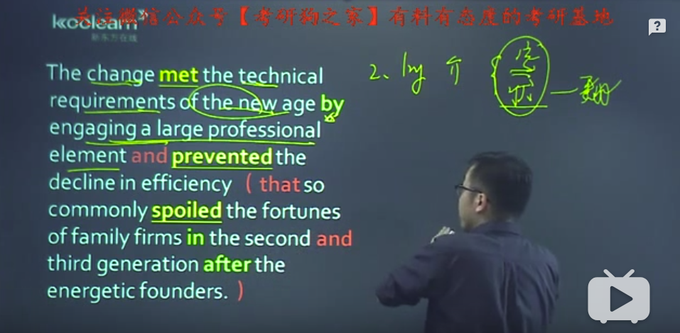
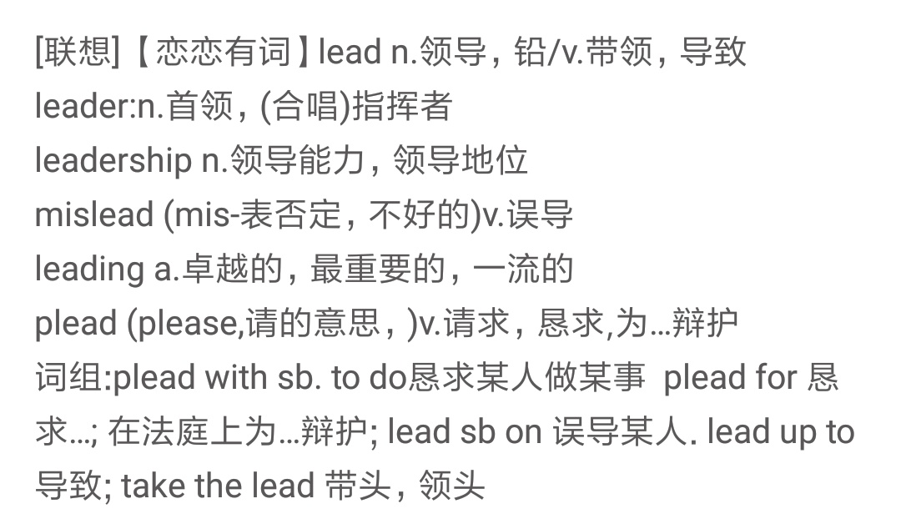
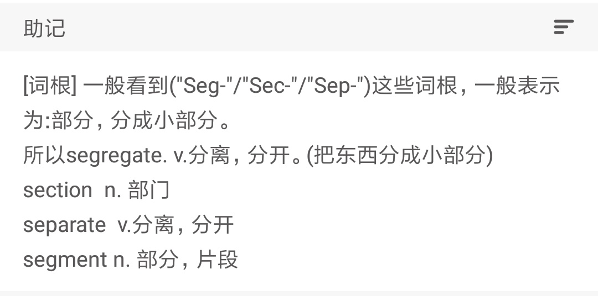
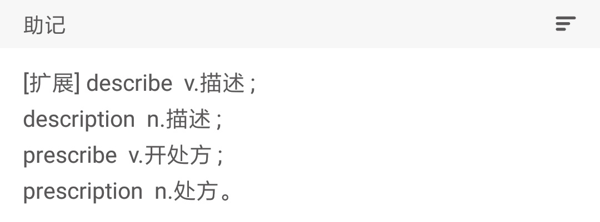
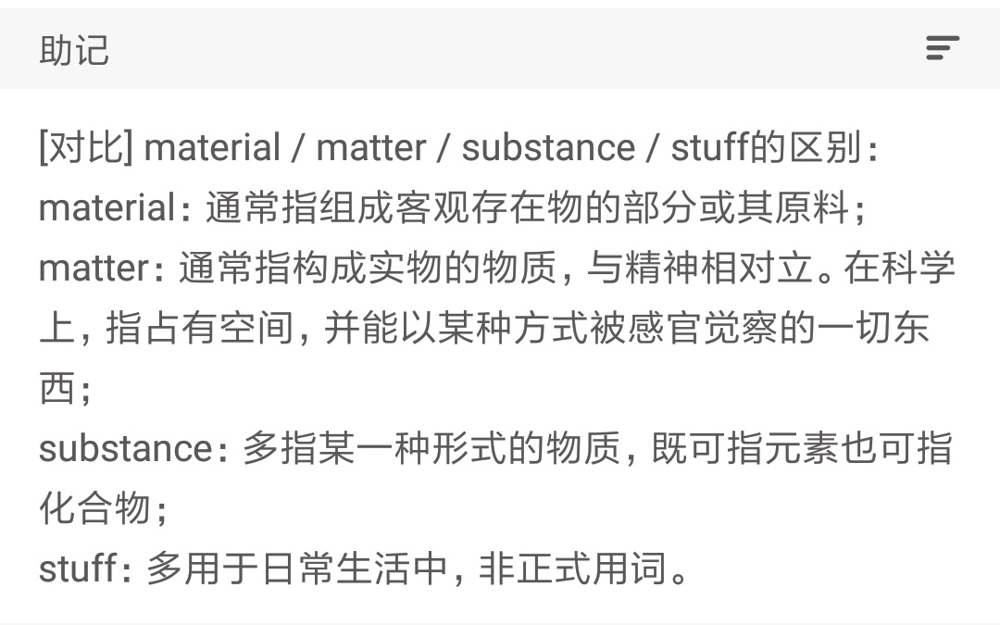
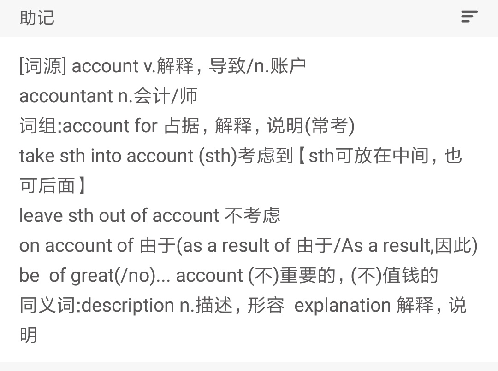
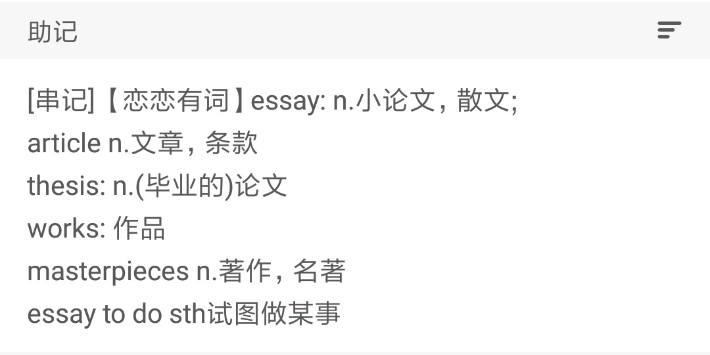
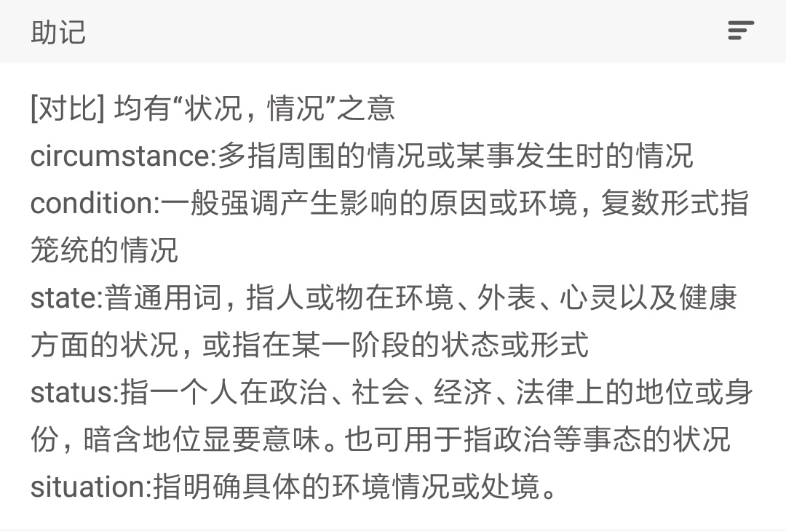
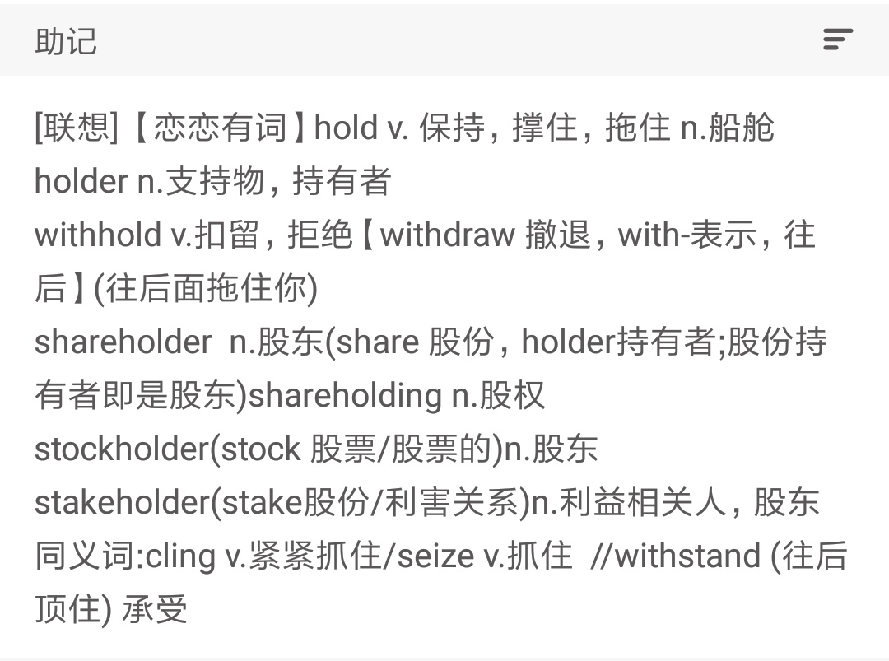
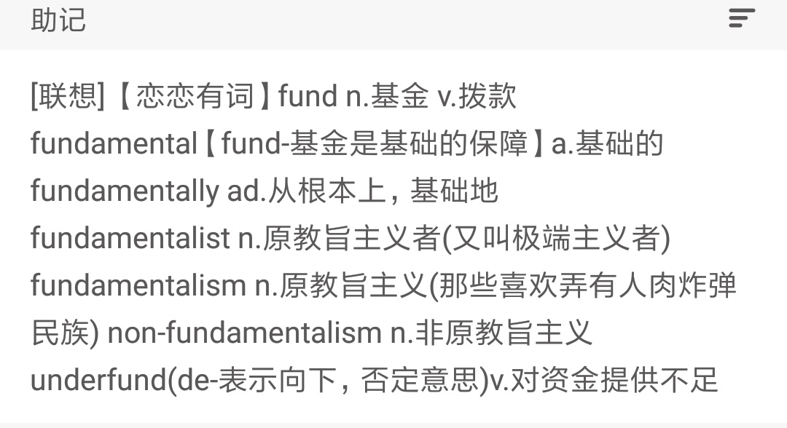

# 8.24

```
bureaucracy     n.官僚主义; 官僚机构; 官僚政治;
democracy       n.民主政治; 民主主义; 民主国家; 民众;
```

```
FBI
- federal
- bureau
- investigation
```


```
meet 满足
```
```
decline (经济->美国经济->美国经济的衰退)
n.下降; （力量、健康、品格、权力、价值等的） 衰退; 下倾; （人、生命等的） 衰退期;
vt.辞谢，谢绝（邀请等）;
vi.（道路、物体等） 下倾; （太阳） 落下; （在品格、价值上） 降低; 衰落，谢绝;
```
```
spoil
vi.变质; 掠夺; 腐败;
vt.损坏，糟蹋; 把（酒，肉等）放坏; 溺爱坏，宠坏（孩子等）; 抢劫，掠夺;
n.抢劫，掠夺; 废品，次品; 成功所带来的好处; （开掘等时挖出的） 弃土;
```

```
subjective 主观的
objective 客观的
```

```
fulfillment  n.实现; 完成; 满足（感）; 实施过程;

promote 
vt.促进，推进; 提升，助长; 促销; 使（学生）升级;
vi.成为王后或其他大于卒的子;

crabbed	
adj.脾气坏的; 易怒的; （指字迹） 难辨认的; （字迹等） 难辨认的;

```
---


---



---

```
由于
as a result of
on account of
because of
due to
owe A to B

```
```
depart  v.离开，出发; 去世; 离职; 脱轨;
in substance 本质上
substance abuse 物质滥用
illustrate your points 阐述你的观点
sow 播种
```
---








